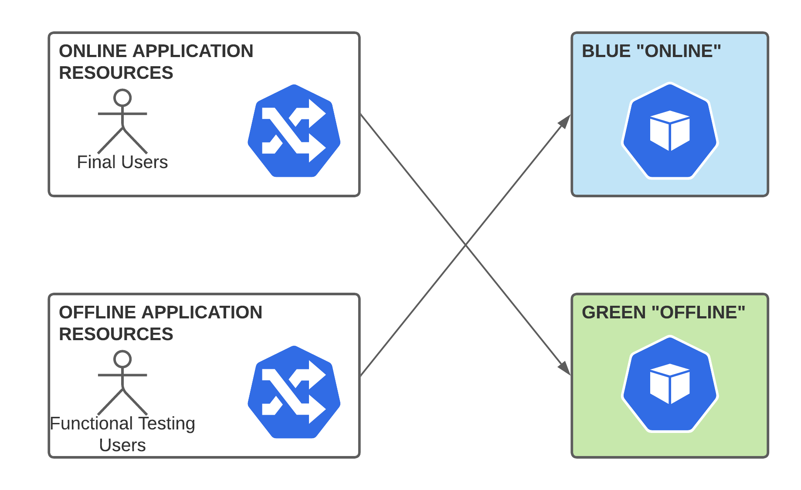
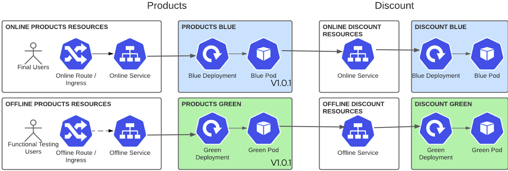
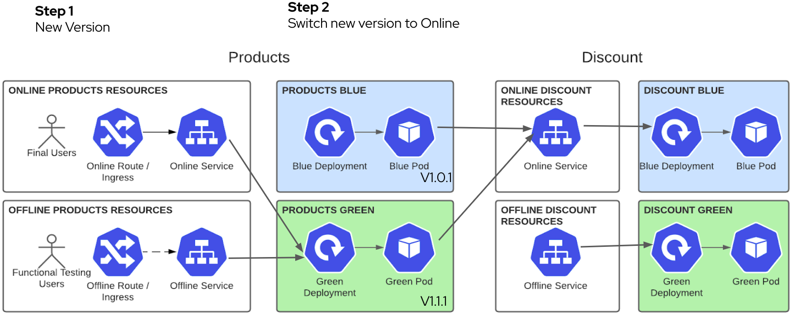

# Cloud Native Blue/Green
 
## Introduction
 
One important topic in the `Cloud Native` is the `Microservice Architecture`. We are not any more dealing with one monolithic application. We have several applications that have dependencies on each other and also have other dependencies like brokers or data bases.
 
Applications have their own life cycle, so we should be able to execute independent blue/green deployment. All the applications and dependencies will not change its version at the same time.
 
Another important topic in the `Cloud Native` is the `Continuous Delivery`. If we are going to have several applications doing Blue/Green deployment independently we have to automate it. We will use **Helm**, **Openshift Pipelines**, **Openshift GitOps** and of course **Red Hat Openshift** to help us.
 
**In the next steps we will see a real example of how to install, deploy and manage the life cycle of Cloud Native applications doing Blue/Green deployment.**
 
Let's start with some theory...after it we will have the **hands on example**.
 
## Blue/Green Deployment
 
Blue green deployment is an application release model that transfers user traffic from a previous version of an app or microservice to a nearly identical new release, both of which are running in production.
The old version can be called the blue environment while the new version can be known as the green environment. Once production traffic is transferred from blue to green, blue can standby in case of rollback or pulled from production and updated to become the template upon which the next update is made.
 
Advantages:
- Minimize downtime
- Rapid way to rollback
- Smoke testing
 
Disadvantages:
- Doubling of total resources
- Backwards compatibility
 
 

 
We have two versions up and running in production, online and offline. The routers and services never change, they are always online or offline.
Because we have an offline version, we can do **smoke test** before switching it to online.
When a new version is ready to be used by the users we only change the deployment that the online service is using.
 

 
There is **minimum downtime** and we can do a **rapid rollback** just undoing the changes in the services.
 
However, meanwhile we are going to do the switch, we have to be ready to do a rapid rollback. We need the **doubling or total resources** (we will see how to minimize this).
It is also very important to keep **backwards compatibility**. Without it, we can not do independent Blue/Green deployments.
## Shop application
 
We are going to use very simple applications to test Blue/Green deployment. We have create two Quarkus applications `Products` and `Discounts`
 

 
`Products` call `Discounts` to get the product`s discount and expose an API with a list of products with its discounts.
 
## Shop Blue/Green
 
To achieve blue/green deployment with `Cloud Native` applications we have designed this architecture.
 

 
OpenShift Components - Online
- Routes and Services declared with suffix -online
- Routes mapped only to the online services
- Services mapped to the deployment with the color flag (Green or Orange)
 
OpenShift Components - Offline
- Routes and Services declared with suffix -offline
- Routes mapped only to the offline services
- Services mapped to the deployment with the color flag (Green or Orange)
 
Notice that the routers and services do not have color, this is because they never change, they are always online or offline. However deployments and pods will change their version.
 
## Shop Umbrella Helm Chart
 
One of the best ways to package `Cloud Native` applications is `Helm`. In blue/green deployment it makes even more sense.
We have created a chart for each application that does not know anything about blue/green. Then we pack everything together in an umbrella helm chart.
 

 
In the `Shop Umbrella Chart` we use several times the same charts as helm dependencies but with different names if they are blue/green or online/offline. This will allow us to have different configurations for each color.
 
This is the Chart.yaml
```
apiVersion: v2
name: shop-umbrella-blue-green
description: A Helm chart for Kubernetes
type: application
version: 0.1.0
appVersion: "1.16.0"
 
dependencies:
 - name: quarkus-helm-discounts
   version: 0.1.0
   alias: discounts-blue
   tags:
     - discounts-blue
 - name: quarkus-helm-discounts
   version: 0.1.0
   alias: discounts-green
   tags:
     - discounts-green
 - name: quarkus-base-networking
   version: 0.1.0
   alias: discountsNetworkingOnline 
   tags:
     - discountsNetworkingOnline
 - name: quarkus-base-networking
   version: 0.1.0
   alias: discountsNetworkingOffline
   tags:
     - discountsNetworkingOffline
 - name: quarkus-helm-products
   version: 0.1.0
   alias: products-blue
   tags:
     - products-blue
 - name: quarkus-helm-products
   version: 0.1.0
   alias: products-green
   tags:
     - products-green
 - name: quarkus-base-networking
   version: 0.1.0
   alias: productsNetworkingOnline
   tags:
     - productsNetworkingOnline
 - name: quarkus-base-networking
   version: 0.1.0
   alias: productsNetworkingOffline
   tags:
     - productsNetworkingOffline
```
 
We have packaged both applications in one chart, but we may have different umbrella charts per application.
 
## Demo!!
 
First step is to fork this repository, you will have to do some changes and commits. You should clone your forked repository in your local.
 
 
If we want to have a `Cloud Native` deployment we can not forget `CI/CD`. **OpenShift GitOps** and **Openshift Pipelines** will help us.
### Install OpenShift GitOps
 
Go to the folder where you have clone your forked repository and create a new branch `blue-green`
```
git checkout -b blue-green
git push origin blue-green
```
 
Log into OpenShift as a cluster admin and install the OpenShift GitOps operator with the following command. This may take some minutes.
```
oc apply -f gitops/gitops-operator.yaml
```
 
Once OpenShift GitOps is installed, an instance of Argo CD is automatically installed on the cluster in the `openshift-gitops` namespace and a link to this instance is added to the application launcher in OpenShift Web Console.
 

 
### Log into Argo CD dashboard
 
Argo CD upon installation generates an initial admin password which is stored in a Kubernetes secret. In order to retrieve this password, run the following command to decrypt the admin password:
 
```
oc extract secret/openshift-gitops-cluster -n openshift-gitops --to=-
```
 
Click on Argo CD from the OpenShift Web Console application launcher and then log into Argo CD with `admin` username and the password retrieved from the previous step.
 

 

 
### Configure OpenShift with Argo CD
 
We are going to follow, as much as we can, a GitOps methodology in this demo. So we will have everything in our Git repository and use **ArgoCD** to deploy it in the cluster.
 
In the current Git repository, the [gitops/cluster-config](gitops/cluster-config/) directory contains OpenShift cluster configurations such as:
- namespaces `blue-green-gitops`.
- operator **Openshift Pipelines**.
- cluster role `tekton-admin-view`.
- role binding for ArgoCD and Pipelines to the namespace `blue-green-gitops`.
- `pipelines-blue-green` the pipelines that we will see later for blue/green deployment.
- `shop-blue-green` the application that we are going to use to test blue/green deployment.
- Tekton cluster role.
- Tekton tasks for git and Openshift clients.
 
Let's configure Argo CD to recursively sync the content of the [gitops/cluster-config](gitops/cluster-config/) directory to the OpenShift cluster.
 
Execute this command to add a new Argo CD application that syncs a Git repository containing cluster configurations with the OpenShift cluster.
 
```
oc apply -f gitops/application-cluster-config.yaml -n openshift-gitops
```
 
Looking at the Argo CD dashboard, you would notice that three applications have been created[^note].
 
[^note]:
    `pipelines-blue-green` will have status `Progressing` till we execute the first pipeline.
 

 
You can click on the `blue-green-cluster-configuration` application to check the details of sync resources and their status on the cluster.
 

 
 
You can check that a namespace called `blue-green-gitops` is created on the cluster, the **Openshift Pipelines operator** is installed, and also the other to applications has been created `pipelines-blue-green` and `shop-blue-green`
 
## Test Shop application
 
We have deployed the `shop-blue-green` with ArgoCD. We can test that it is up and running.
 
We have to get the Online route
```
echo "$(oc get routes products-umbrella-online -n blue-green-gitops --template='http://{{.spec.host}}')/products"
```
And the Offline route
```
echo "$(oc get routes products-umbrella-offline -n blue-green-gitops --template='http://{{.spec.host}}')/products"
```
Notice that in each microservice response we have added metadata information to see better the `version`, `color`, `mode` of each application. This will help us to see the changes while we do the Blue/Green deployment.
Because right now we have the same version v1.0.1 in both colors we will have almost the same response, only the mode will change.
```json
{
  "products":[
     {
        "discountInfo":{
           "discounts":[
              {
                 "name":"BlackFriday",
                 "price":"1350€",
                 "discount":"10%"
              }
           ],
           "metadata":{
              "version":"v1.0.1",
              "colour":"blue",
              "mode":"online" <--
           }
        },
        "name":"TV 4K",
        "price":"1500€"
     }
  ],
  "metadata":{
     "version":"v1.0.1",
     "colour":"blue",
     "mode":"online" <--
  }
}
```
 
 
 
 
 
## Products Blue/Green deployment
 
We have split a `Cloud Native` Blue/Green deployment in four steps:
1. Deploy new version.
2. Change to online configuration.
3. Switch new version to Online.
4. Align and scale down Offline.
 
Using **Openshift Pipelines**, we have created a pipeline with those fourth steps to manage the Blue/Green deployment. This pipeline is the same for both applications, now we are going to use it for Products application.
Because the pipeline push that changes done in the helm values on each step. **Openshift Pipelines** needs a **GitHub** token to do the push. Because we don`t want to set your **GitHub** token on git we have to do those steps manually and not with GitOps methodology.
```
export TOKEN=XXXXXX
```
```
export GIT_USER=YYY
```
 
```
oc create secret generic github-token --from-literal=username=${GIT_USER} --from-literal=password=${TOKEN} --type "kubernetes.io/basic-auth" -n blue-green-gitops
oc annotate secret github-token "tekton.dev/git-0=https://github.com/${GIT_USER}" -n blue-green-gitops
oc secrets link pipeline github-token -n blue-green-gitops
```
 
We have already deployed the product's version v1.0.1, and we have ready to use a new product's version v1.1.1 that has a new `description` attribute.
 
This is our current status:

 
 
### Step 1 - Deploy new version
 
We will start deploying a new version v1.1.1 in the offline color. But instead of going manually to see which is the offline color and deploy the new version on it, let's let the pipeline find the current offline color and automatically deploy the new version, with no manual intervention.
We will use the already created pipelinerun to execute the first step with the new version v1.1.1
```
cd pipelines/run-products
oc create -f 1-pipelinerun-products-new-version.yaml -n blue-green-gitops
```

 
The pipeline has committed the changes in GitHub. ArgoCD will refresh the status after some minutes. If you don't want to wait you can refresh it manually from ArgoCD UI.

 
After the pipeline finished and ArgoCD has synchronized the changes this will be the `Shop` status:

 
 
See that offline applications have the version v1.1.1 and the new attribute description, but the online has not changed.
 
```json
{
  "products":[
     {
        "discountInfo":{...},
        "name":"TV 4K",
        "price":"1500€",
        "description":"The best TV" <--
     }
  ],
  "metadata":{
     "version":"v1.1.1", <--
     "colour":"green",
     "mode":"offline" <--
  }
}
```
Functional testing users can execute `Smoke tests` to validate this new v1.1.1 version.
 
### Step 2 - Change to online configuration
 
Now we are going to change the configuration to online and also scale up the application to be ready for final users requests.
The pipeline first will change the configuration and scale to 0, second will scale up the application to production number of replicas.
 
```
oc create -f 2-pipelinerun-products-configuration.yaml -n blue-green-gitops
```
This step may take more time because we are doing two different commits, so ArgoCD has to synchronize the first one in order to continue with the pipeline. If you want to make it faster you can refresh ArgoCD manually after the step `commit-configuration`.

 
After the pipeline finished and ArgoCD has synchronized the changes this will be the `Shop` status:

We can see that now offline `Products` is calling `Discounts` online application.
```json
"discountInfo":{
  "discounts":[...],
  "metadata":{
     "version":"v1.0.1",
     "colour":"blue",
     "mode":"online" <--
  }
}
```
At this point the application is ready to receive real traffic.
### Step 3 - Switch new version to Online
 
We are going to open the new version to final users. The pipeline will just change the service to use the other color. Again the pipeline does this automatically without manual intervention. We also `minimize downtime` because it just changes the service label.
```
oc create -f 3-pipelinerun-products-switch.yaml -n blue-green-gitops
```

After the pipeline finished and ArgoCD has synchronized the changes this will be the `Shop` status:

**We have in the online environment the new version v1.1.1!!!**
```json
{
  "products":[
     {
        "discountInfo":{...},
        "name":"TV 4K",
        "price":"1500€",
        "description":"The best TV" <--
     }
  ],
  "metadata":{
     "version":"v1.1.1", <--
     "colour":"green",
     "mode":"online" <--
  }
}
```
 
### Step 3,5 - Rollback
 
Imagine that something goes wrong, we know that this never happens but just in case. We can do a very `quick rollback` just undoing the change in the `Products` online service. But are we sure that with all the pressure that we will have at this moment, we will find the right service and change the label to the right color. Let's move this pressure to the pipeline. We can have a pipeline for rollback.
```
oc create -f 3-pipelinerun-products-switch-rollback.yaml -n blue-green-gitops
```

After the pipeline finished and ArgoCD has synchronized the changes this will be the `Shop` status:

We have version v1.0.1 online again.
```json
{
  "products":[
     {
        "discountInfo":{...},
        "name":"TV 4K",
        "price":"1500€",
     }
  ],
  "metadata":{
     "version":"v1.0.1", <--
     "colour":"blue",
     "mode":"online" <--
  }
}
```
 
After fixing the issue we can execute the Switch step again.
```
oc create -f 3-pipelinerun-products-switch.yaml -n blue-green-gitops
```

We have in the online environment the new version v1.1.1 again.
```json
{
  "products":[
     {
        "discountInfo":{...},
        "name":"TV 4K",
        "price":"1500€",
        "description":"The best TV" <--
     }
  ],
  "metadata":{
     "version":"v1.1.1", <--
     "colour":"green",
     "mode":"online" <--
  }
}
```
### Step 4 - Align and scale down Offline
 
Finally, when online is stable we should align offline with the new version and scale it down. Does not make sense to use the same resources that we have in production.
```
oc create -f 4-pipelinerun-products-scale-down.yaml -n blue-green-gitops
```

After the pipeline finished and ArgoCD has synchronized the changes this will be the `Shop` status:

We can see that the offline `Products` is calling offline `Discounts` and has the new version v1.1.1
```json
{
  "products":[
     {
        "discountInfo":{
           "discounts":[
              {
                 "name":"BlackFriday",
                 "price":"1350€",
                 "discount":"10%",
                 "description":null
              }
           ],
           "metadata":{
              "version":"v1.0.1",
              "colour":"green",
              "mode":"offline" <--
           }
        },
        "name":"TV 4K",
        "price":"1500€",
        "description":"The best TV"
     }
  ],
  "metadata":{
     "version":"v1.1.1", <--
     "colour":"blue",
     "mode":"offline" <--
  }
}
```
## Delete environment
 
To delete all the thing that we have done for the demo you have to_
- In GitHub delete the branch `blue-green`
- In ArgoCD delete the application `blue-green-cluster-configuration`
- In Openshift, go to project `openshift-operators` and delete the installed operators **Openshift GitOps** and **Openshift Pipelines**


