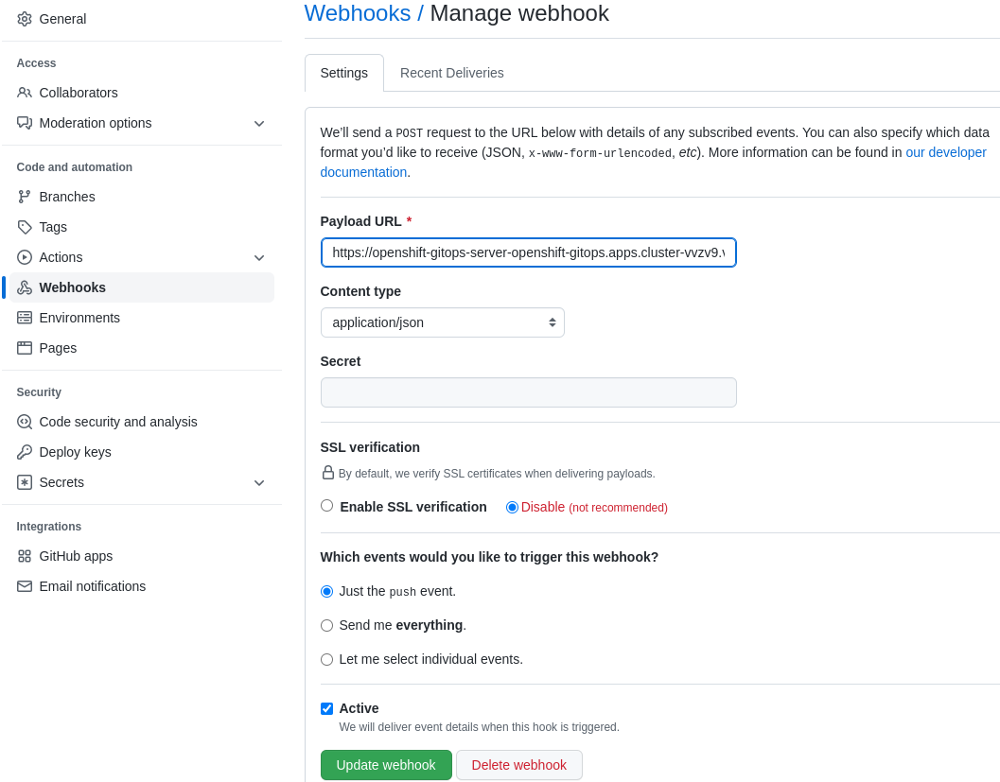
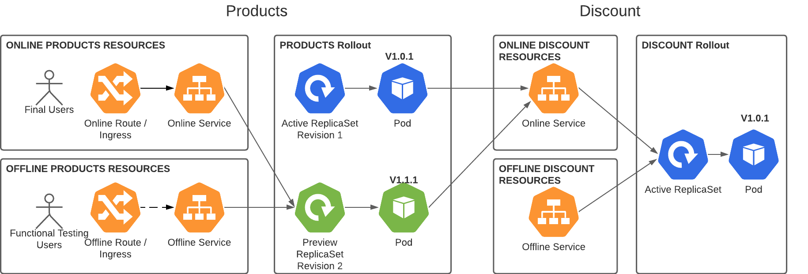

# Cloud Native Blue/Green Deployment Strategy using Argo Rollouts

## Introduction
One important topic in the `Cloud Native` is the `Microservice Architecture`. We are not any more dealing with one monolithic application. We have several applications that have dependencies on each other and also have other dependencies like brokers or data bases.
 
Applications have their own life cycle, so we should be able to execute independent blue/green deployment. All the applications and dependencies will not change its version at the same time.
 
Another important topic in the `Cloud Native` is `Continuous Delivery`. If we are going to have several applications doing Blue/Green deployment independently we have to automate it. We will use **Helm**, **Argo Rollouts**, **Openshift GitOps** and of course **Red Hat Openshift** to help us.
 
**In the next steps we will see a real example of how to install, deploy and manage the life cycle of Cloud Native applications doing Blue/Green deployment.**
 
If you want to know more about Blue/Green deployment please read [**Blue/Green Deployment**](https://github.com/davidseve/cloud-native-deployment-strategies/tree/main/blue-green-pipeline#bluegreen-deployment)

Let's start with some theory...after it we will have the **hands on example**.
## Shop application
 
We are going to use very simple applications to test Blue/Green deployment. We have created two Quarkus applications `Products` and `Discounts`
 

 
`Products` call `Discounts` to get the product`s discount and expose an API with a list of products with its discounts.
 
## Shop Blue/Green
 
To achieve blue/green deployment with `Cloud Native` applications using **Argo Rollouts**, we have designed this architecture.


 
OpenShift Components - Online
- Routes and Services declared with suffix -online
- Routes mapped only to the online services
- Services mapped to the rollout.
 
OpenShift Components - Offline
- Routes and Services declared with suffix -offline
- Routes mapped only to the offline services
- Services mapped to the rollout

This is an example of products rollout manifest:
```yaml
  strategy:
    blueGreen:
      activeService: products-umbrella-online
      previewService: products-umbrella-offline      
      autoPromotionEnabled: false
      prePromotionAnalysis:
        templates:
          - templateName: products-analysis-template
```
 
## Shop Umbrella Helm Chart
 
One of the best ways to package `Cloud Native` applications is `Helm`. In blue/green deployment it makes even more sense.
We have created a chart for each application that does not know anything about blue/green. Then we pack everything together in an umbrella helm chart.


In the `Shop Umbrella Chart` we use several times the same charts as helm dependencies but with different names if they are online/offline. This will allow us to have different configurations for each color.
 
We have packaged both applications in one chart, but we may have different umbrella charts per application.
## Demo!!

The first step is to fork this repository, you will have to do some changes and commits. You should clone your forked repository in your local.

If we want to have a `Cloud Native` deployment we can not forget `CI/CD`. **OpenShift GitOps** and **Openshift Pipelines** will help us.
 
### Install OpenShift GitOps
 
Go to the folder where you have cloned your forked repository and create a new branch `rollouts`
```
git checkout -b rollouts
git push origin rollouts
```
 
Log into OpenShift as a cluster admin and install the OpenShift GitOps operator with the following command. This may take some minutes.
```
oc apply -f gitops/gitops-operator.yaml
```
 
Once OpenShift GitOps is installed, an instance of Argo CD is automatically installed on the cluster in the `openshift-gitops` namespace and a link to this instance is added to the application launcher in OpenShift Web Console.
 

 
### Log into Argo CD dashboard
 
Argo CD upon installation generates an initial admin password which is stored in a Kubernetes secret. In order to retrieve this password, run the following command to decrypt the admin password:
 
```
oc extract secret/openshift-gitops-cluster -n openshift-gitops --to=-
```
 
Click on Argo CD from the OpenShift Web Console application launcher and then log into Argo CD with `admin` username and the password retrieved from the previous step.
 

 

 
### Configure OpenShift with Argo CD
 
We are going to follow, as much as we can, a GitOps methodology in this demo. So we will have everything in our Git repository and use **ArgoCD** to deploy it in the cluster.
 
In the current Git repository, the [gitops/cluster-config](../gitops/cluster-config/) directory contains OpenShift cluster configurations such as:
- namespaces `gitops`.
- role binding for ArgoCD to the namespace `gitops`.
- Argo Rollouts project.
 
Let's configure Argo CD to recursively sync the content of the [gitops/cluster-config](../gitops/cluster-config/) directory to the OpenShift cluster.
 
Execute this command to add a new Argo CD application that syncs a Git repository containing cluster configurations with the OpenShift cluster.
 
```
oc apply -f blue-green-argo-rollouts/application-cluster-config.yaml
```
 
Looking at the Argo CD dashboard, you would notice that an application has been created.

You can click on the `cluster-configuration` application to check the details of sync resources and their status on the cluster.

### Create Shop application

We are going to create the application `shop`, that we are going to use to test blue/green deployment. Because we will make changes in the application's GitHub repository, we have to use the repository that you have just forked. Please edit the file `blue-green-argo-rollouts/application-shop-blue-green-rollouts.yaml` and set your own GitHub repository in the `reportURL`.

```yaml
apiVersion: argoproj.io/v1alpha1
kind: Application
metadata:
  name: shop
  namespace: openshift-gitops
spec:
  destination:
    name: ''
    namespace: gitops
    server: 'https://kubernetes.default.svc'
  source:
    path: helm/quarkus-helm-umbrella/chart
    repoURL:  https://github.com/change_me/cloud-native-deployment-strategies.git
    targetRevision: rollouts
    helm:
      parameters:
      - name: "global.namespace"
        value: gitops
      valueFiles:
        - values/values-rollouts.yaml
  project: default
  syncPolicy:
    automated:
      prune: false
      selfHeal: false
```

```
oc apply -f blue-green-argo-rollouts/application-shop-blue-green-rollouts.yaml
```

Looking at the Argo CD dashboard, you would notice that we have a new `shop` application.


## Test Shop application
 
We have deployed the `shop` with ArgoCD. We can test that it is up and running.
 
We have to get the Online route
```
echo "$(oc get routes products-umbrella-online -n gitops --template='http://{{.spec.host}}')/products"
```
And the Offline route
```
echo "$(oc get routes products-umbrella-offline -n gitops --template='http://{{.spec.host}}')/products"
```
Notice that in each microservice response we have added metadata information to see better the `version` of each application. This will help us to see the changes while we do the Blue/Green deployment.
Because right now we have both routers against the same rollout revision we will have the same response with version `v1.0.1`:
```json
{
   "products":[
      {
         ...
         "name":"TV 4K",
         "price":"1500€"
      }
   ],
   "metadata":{
      "version":"v1.0.1", <--
      "colour":"none",
      "mode":"online"
   }
}
```

We can also see the rollout`s status[^note].

[^note]:
    Argo Rollouts offers a Kubectl plugin to enrich the experience with Rollouts https://argoproj.github.io/argo-rollouts/installation/#kubectl-plugin-installation 

```
kubectl argo rollouts get rollout products --watch -n gitops
```

```
NAME                                  KIND        STATUS     AGE INFO
⟳ products                            Rollout     ✔ Healthy  12m  
└──# revision:1                                                   
   └──⧉ products-67fc9fb79b           ReplicaSet  ✔ Healthy  12m  stable,active
      ├──□ products-67fc9fb79b-49k25  Pod         ✔ Running  12m  ready:1/1
      └──□ products-67fc9fb79b-p7jk9  Pod         ✔ Running  12m  ready:1/1
```

 
## Products Blue/Green deployment
 
We have split a `Cloud Native` Blue/Green deployment into two steps:
1. Deploy a new version.
2. Promote a new version
 

 
We have already deployed the products version v1.0.1, and we are ready to use a new products version v1.1.1 that has a new `description` attribute.

This is our current status:

### Step 1 - Deploy a new version
 
We will deploy a new version v1.1.1
In the file `helm/quarkus-helm-umbrella/chart/values/values-rollouts.yaml` under `products-blue` set `tag` value to `v.1.1.1`

```yaml
products-blue:
  mode: online
  image:
    tag: v1.1.1
```

And push the changes
```
git add .
git commit -m "Change products version to v1.1.1"
git push origin rollouts
```

 ArgoCD will refresh the status after some minutes. If you don't want to wait you can refresh it manually from ArgoCD UI or configure the Argo CD Git Webhook.[^note2].
 
[^note2]:
    Here you can see how to configure the Argo CD Git [Webhook]( https://argo-cd.readthedocs.io/en/stable/operator-manual/webhook/)
    


 
**Argo Rollouts** will automatically deploy the new products version and execute the `prePromotionAnalysis`. 

```
NAME                                  KIND         STATUS        AGE  INFO
⟳ products                            Rollout      ॥ Paused      27m  
├──# revision:2                                                       
│  ├──⧉ products-9dc6f576f            ReplicaSet   ✔ Healthy     36s  preview
│  │  ├──□ products-9dc6f576f-6vqp5   Pod          ✔ Running     36s  ready:1/1
│  │  └──□ products-9dc6f576f-lmgd7   Pod          ✔ Running     36s  ready:1/1
│  └──α products-9dc6f576f-2-pre      AnalysisRun  ✔ Successful  31s  ✔ 1
└──# revision:1                                                       
   └──⧉ products-67fc9fb79b           ReplicaSet   ✔ Healthy     27m  stable,active
      ├──□ products-67fc9fb79b-49k25  Pod          ✔ Running     27m  ready:1/1
      └──□ products-67fc9fb79b-p7jk9  Pod          ✔ Running     27m  ready:1/1
```
  
If the `prePromotionAnalysis` goes well, we can see that offline applications have the version v1.1.1 and the new attribute description, but the online version has not changed.

This is our current status:


 
```json
{
  "products":[
     {
        "discountInfo":{...},
        "name":"TV 4K",
        "price":"1500€",
        "description":"The best TV" <--
     }
  ],
  "metadata":{
     "version":"v1.1.1", <--
  }
}
```
Functional testing users can execute `Smoke tests` to validate this new v1.1.1 version.

We have to be careful with those tests in a production environment because the product microservice will call the online dependencies.
If this dependency is for example a production DB we will create the things that our `Smoke tests` do.
 
### Step 2 - Promote a new version
 
We are going to open the new version to final users.

Execute this command to promote products:
```
kubectl argo rollouts promote products -n gitops
```

First **Argo Rollouts** will just change the service to use the new release (ReplicaSet). We `minimize downtime` because it just changes the service label. 

```
NAME                                  KIND         STATUS        AGE  INFO
⟳ products                            Rollout      ✔ Healthy     88m  
├──# revision:2                                                       
│  ├──⧉ products-9dc6f576f            ReplicaSet   ✔ Healthy     62m  stable,active
│  │  ├──□ products-9dc6f576f-6vqp5   Pod          ✔ Running     62m  ready:1/1
│  │  └──□ products-9dc6f576f-lmgd7   Pod          ✔ Running     62m  ready:1/1
│  └──α products-9dc6f576f-2-pre      AnalysisRun  ✔ Successful  62m  ✔ 1
└──# revision:1                                                       
   └──⧉ products-67fc9fb79b           ReplicaSet   ✔ Healthy     88m  delay:27s
      ├──□ products-67fc9fb79b-49k25  Pod          ✔ Running     88m  ready:1/1
      └──□ products-67fc9fb79b-p7jk9  Pod          ✔ Running     88m  ready:1/1
```
This is our current status:


And after `scaleDownDelaySeconds` **Argo Rollouts** will scale down the first replicaSet (v1.0.1).
 
```
 NAME                                 KIND         STATUS        AGE  INFO
⟳ products                           Rollout      ✔ Healthy     89m  
├──# revision:2                                                      
│  ├──⧉ products-9dc6f576f           ReplicaSet   ✔ Healthy     62m  stable,active
│  │  ├──□ products-9dc6f576f-6vqp5  Pod          ✔ Running     62m  ready:1/1
│  │  └──□ products-9dc6f576f-lmgd7  Pod          ✔ Running     62m  ready:1/1
│  └──α products-9dc6f576f-2-pre     AnalysisRun  ✔ Successful  62m  ✔ 1
└──# revision:1                                                      
   └──⧉ products-67fc9fb79b          ReplicaSet   • ScaledDown  89m  
```

This is our final status:


**We have in the online environment the new version v1.1.1!!!**
```json
{
  "products":[
     {
        "discountInfo":{...},
        "name":"TV 4K",
        "price":"1500€",
        "description":"The best TV" <--
     }
  ],
  "metadata":{
     "version":"v1.1.1", <--
  }
}
```

### Step 2.5 - Rollback

Imagine that something goes wrong, we know that this never happens but just in case. We can do a very `quick rollback` just undoing the change in the `Products` online service.

**Argo Rollouts** has an [undo](https://argoproj.github.io/argo-rollouts/generated/kubectl-argo-rollouts/kubectl-argo-rollouts_undo/) command to do the rollback. Personally, I don't like this procedure because it is not aligned with GitOps. The changes that **Argo Rollouts** do does not come from git, so git is OutOfSync with what we have in Openshift.
In our case the commit that we have done not only changes the ReplicaSet but also the ConfigMap. The `undo` command only changes the ReplicaSet, so it does not work for us.

I recommend doing the changes in git. We will revert the last commit
```
git revert HEAD
git push origin rollouts
```
**ArgoCD** will get the changes and apply them. **Argo Rollouts** will create a new revision with the previous version.
Execute this command to promote products to version `v1.0.1`:
```
kubectl argo rollouts promote products -n gitops
```
The rollback is done!

## Delete environment
 
To delete all the thing that we have done for the demo you have to_
- In GitHub delete the branch `rollouts`
- In ArgoCD delete the application `cluster-configuration` and `shop`
- In Openshift, go to project `openshift-operators` and delete the installed operators **Openshift GitOps** and **Openshift Pipelines**


